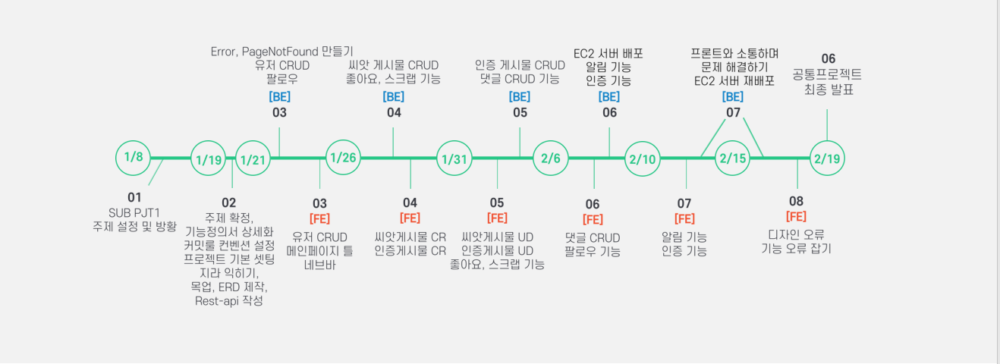
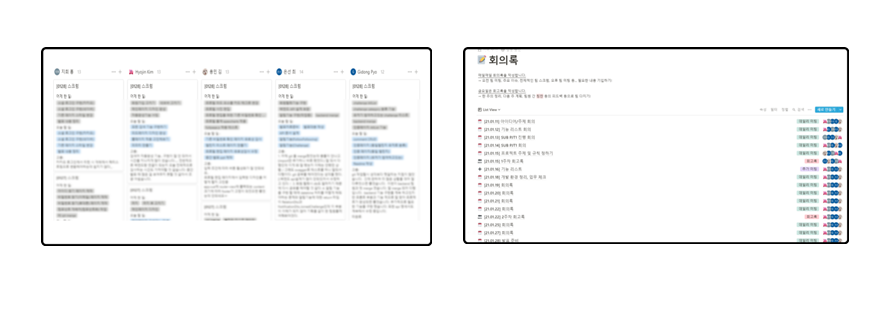
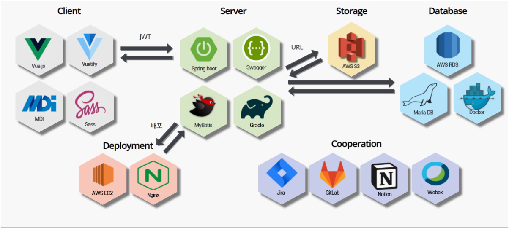
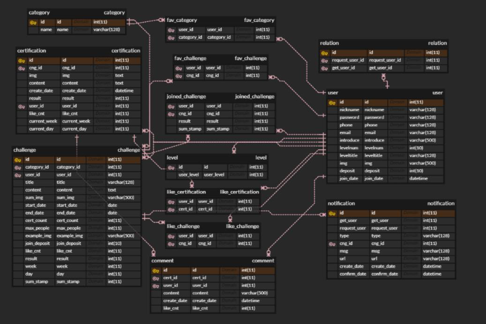

<p align="center">📆 2021.01.08 ~ 2021.02.19 </p>

<p align="center">
	<strong>작심삼일에 지친 어른이들을 위한 "목표관리 SNS 서비스</strong>
    <br/>
    <br/>
</p>
<br/><br>

## 🌳 About 우목이

#### 🌱 기획의도

많은 사람들은 새해가 밝으면, 그 한 해 자신이 이루고자 하는 목표를 설정합니다.  하지만 작심삼일이란 사자성어의 존재이유를 뒷받침하듯이, 처음의 열정은 사그라들고 맙니다. `우목이`는 이러한 어른이들이 자신이 설정한 목표를 이루어나갈 수 있도록 돕기 위해 탄생되었습니다. 우목이는 목표를 함께 달성할 **동료 모집**과 **SNS 기능**을 통해 사용자의 고독감을 해소하고,  자신의 페이스메이커를 설정할 수 있도록 돕습니다. 또한  **인증시스템**과 **레벨시스템**을 통해 사용자가 목표를 달성할 힘을 얻을 수 있는 서비스를 제공하고자 합니다. 

</br>

</br>

#### 🌱 타겟 유저

- **다른 유저들과의 소통을 통해,  목표 달성 시 고독감을 해소하고 싶은 사람**

- ##### 감시자 설정을 통해 의무감을 갖고 싶은 사람

- ##### 다양한 사람들의 도전을 보며 자극 받고 싶은 사람

- **꾸준히 노력하고 싶게 만드는 시스템이 필요한 사람**

</br>

</br>

#### 🌱 핵심 기능

👩‍👩‍👦**챌린지 참여 기능**

- 챌린지 참여하기 버튼을 누르면, 챌린지 호스트에게 알림이 가요!
- 호스트가 수락하면, 챌린지에 참여할 수 있어요!

<br><br>

✅**인증시스템**

- 적합한 인증샷이라고 판단되면 챌린지 호스트가 확인 도장을 줘요!
- 인증샷의 상태(미승인, 적합, 부적합)에 따라 스탬프가 쌓여요!

<br><br>

##### 👁‍🗨SNS 기능

- 목표 달성을 위해 열심히 노력하는 다른 유저의 인증샷들을 피드에서 볼 수 있어요!
- 귀감이 될 만한 유저가 있으면 팔로우 기능을 통해 나만의 페이스메이커로 설정해봐요!

<br><br>

## 🌳 진행상황  &  문서화
#### 🌱 진행상황



<br><br>

#### 🌱 Cooperation


​	노션을 통해 모든 문서화 작업을 수행하고 있습니다.
​	노션에 작성한 내용을 바탕으로(어제 한 일, 오늘 할 일, 고충) 1일 1스크럼을 진행하고 있습니다.
​	모든 회의내용은 노션에 회의록을 작성하여 문서화했습니다. 

<br><br>

## 🌳 프로젝트 산출물
#### 🌱 시스템 아키텍처


<br><br>

#### 🌱 ERD

#### 
<br><br>

#### 🌱 [컨벤션](https://www.notion.so/332cddb89bff4354b3aee8bc1d2746a8)
#### 🌱 [스웨거](https://www.notion.so/a4d59235ba6f4795b0c7677414e0d766)
<br><br>

## 🌳 실행 방법 


#### `FRONT-END`

- Vue.js [Vue.js 설치](https://kr.vuejs.org/v2/guide/index.html)를 통해 설치할 수 있습니다. 

- ``` $npm install ```

- ```npm run serve``` 를 통해 실행할 수 있습니다. 

- localhost:8080으로 실행할 수 있습니다.

  

#### `BACK-END`

- Java(openjdk version "1.8.0_282") 설치합니다.
- gradle 설치
- DB 테이블 생성
- ```appication.properties``` 파일 생성  후
아래 내용에 맞게 입력
```spring.datasource.driverClassName=com.mysql.cj.jdbc.Driver
   spring.datasource.url=(내용 입력)
   spring.datasource.username=(내용 입력)
   spring.datasource.password=(내용 입력)
```
- /backend/src/main/resource/ 아래 위치 파일을 넣습니다. 
- /backend/ 안에   ->   $ ./gradlew build 빌드 후
- /backend/build/lib 안에 
-```$ java -jar ssafy_pjt2-0.0.1-SNAPSHOT.war --server.servlet.context-path=(실행할 서버주소)```
- 실행

<br><br>

##  🌳 개발진 

| Name   | Role            |
| :----: | :-------------: |
| 김용민 | 프론트엔드 개발 |
|김효진|프론트엔드 개발|
|홍지희|프론트엔드 개발|
|최은선|백엔드 개발|
|표기동|백엔드 개발|


